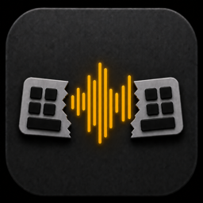

<div align="center">
  
  <h1>roma-just-talk</h1>
  <p>speak at speed of ur thoughts.</p>
  <p>A VoiceInk fork for fast capture, local-first dictation, and a quieter writing flow.</p>

  [](https://www.gnu.org/licenses/gpl-3.0)
  
  [](https://github.com/happyf-weallareeuropean/roma-just-talk/releases)
  
  
  <p>
    <a href="https://github.com/happyf-weallareeuropean/roma-just-talk/releases">Download</a> •
    <a href="https://github.com/Beingpax/VoiceInk">Upstream VoiceInk</a>
  </p>

  <a href="https://github.com/happyf-weallareeuropean/roma-just-talk/releases/latest">
    
  </a>
</div>

---

roma-just-talk is a native macOS voice-to-text app forked from [VoiceInk](https://github.com/Beingpax/VoiceInk). The base is already strong: local transcription, global shortcuts, app-aware behavior, personal dictionary support, and a focused macOS experience.

This fork is about building on that foundation toward a sharper direction: less ceremony, faster capture, and a writing loop that keeps up with thought instead of forcing you into app-shaped pauses.


## Fork Direction

- Keep voice input local-first and private by default
- Reduce friction around starting, stopping, correcting, and continuing speech
- Make dictation feel like a natural extension of thinking, not a separate tool
- Explore tighter workflows for coding, notes, chat, and long-form drafting
- Preserve the parts of VoiceInk that already work well while giving this fork room to diverge

Current status: the app bundle, icon, and many internal names still come from VoiceInk. Rebranding and release automation are expected to evolve gradually.

## Features

- 🎙️ **Accurate Transcription**: Local AI models that transcribe your voice to text with 99% accuracy, almost instantly
- 🔒 **Privacy First**: 100% offline processing ensures your data never leaves your device
- ⚡ **Power Mode**: Intelligent app detection automatically applies your perfect pre-configured settings based on the app/ URL you're on
- 🧠 **Context Aware**: Smart AI that understands your screen content and adapts to the context
- 🎯 **Global Shortcuts**: Configurable keyboard shortcuts for quick recording and push-to-talk functionality
- 📝 **Personal Dictionary**: Train the AI to understand your unique terminology with custom words, industry terms, and smart text replacements
- 🔄 **Smart Modes**: Instantly switch between AI-powered modes optimized for different writing styles and contexts
- 🤖 **AI Assistant**: Built-in voice assistant mode for a quick chatGPT like conversational assistant

## Get Started

### Download
Download the latest fork release from [GitHub Releases](https://github.com/happyf-weallareeuropean/roma-just-talk/releases).

The current published app asset is still based on the upstream VoiceInk release while this fork gets its own build and release flow.

#### Homebrew
Upstream VoiceInk can also be installed via `brew`:

```shell
brew install --cask voiceink
```

### Build from Source
You can build the app yourself by following [BUILDING.md](BUILDING.md).

## Requirements

- macOS 14.4 or later

## Documentation

- [Building from Source](BUILDING.md) - Detailed instructions for building the project
- [Contributing Guidelines](CONTRIBUTING.md) - Original upstream contribution notes
- [Code of Conduct](CODE_OF_CONDUCT.md) - Our community standards

## Contributing

This fork is early. Issues, experiments, and focused patches are welcome when they help the new direction.

Useful contributions right now:
- Reporting bugs via [issues](https://github.com/happyf-weallareeuropean/roma-just-talk/issues)
- Testing local builds on real macOS writing workflows
- Improving rough docs left over from the upstream project
- Proposing focused changes that make voice input faster, calmer, or more reliable

For build instructions, see [BUILDING.md](BUILDING.md).

## License

This project is licensed under the GNU General Public License v3.0 - see the [LICENSE](LICENSE) file for details.

## Support

If you encounter any issues or have questions, please:
1. Check the existing issues in the GitHub repository
2. Create a new issue if your problem isn't already reported
3. Provide as much detail as possible about your environment and the problem

## Acknowledgments

roma-just-talk is built on top of [VoiceInk](https://github.com/Beingpax/VoiceInk). The core app, original product direction, and much of the current implementation come from Pax and the VoiceInk project.

### Core Technology
- [whisper.cpp](https://github.com/ggerganov/whisper.cpp) - High-performance inference of OpenAI's Whisper model
- [FluidAudio](https://github.com/FluidInference/FluidAudio) - Used for Parakeet model implementation

### Essential Dependencies
- [Sparkle](https://github.com/sparkle-project/Sparkle) - Keeping VoiceInk up to date
- [KeyboardShortcuts](https://github.com/sindresorhus/KeyboardShortcuts) - User-customizable keyboard shortcuts
- [LaunchAtLogin](https://github.com/sindresorhus/LaunchAtLogin) - Launch at login functionality
- [MediaRemoteAdapter](https://github.com/ejbills/mediaremote-adapter) - Media playback control during recording
- [Zip](https://github.com/marmelroy/Zip) - File compression and decompression utilities
- [SelectedTextKit](https://github.com/tisfeng/SelectedTextKit) - A modern macOS library for getting selected text
- [Swift Atomics](https://github.com/apple/swift-atomics) - Low-level atomic operations for thread-safe concurrent programming


---

Built from VoiceInk, then pointed toward thought-speed voice workflows.
